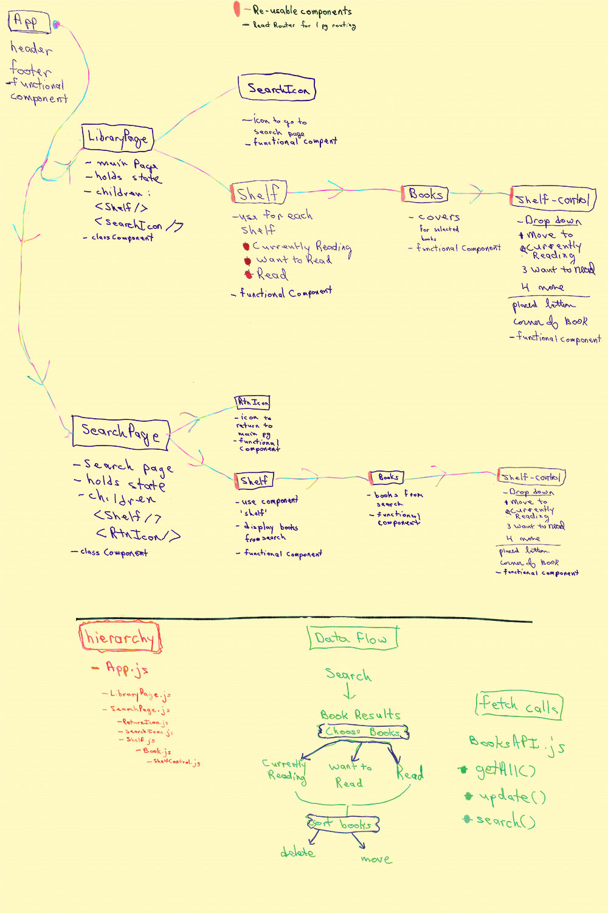
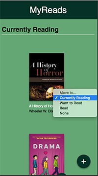
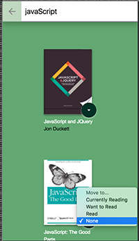
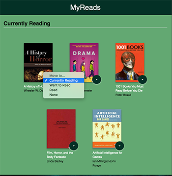
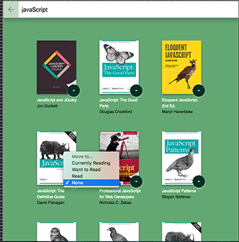
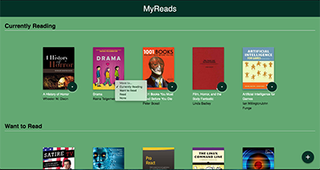
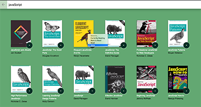

# My Reads App
##### Project for the *Front-End Web Developer Nanodegree*

#### Introduction

**Title**: My Reads

by Rebecca Hanlon

*My Reads* is a bookshelf for storing books.  The user can search for books then choose the book he or she wants to read and add them to the *Currently Reading Shelf*, *Want to Read Shelf* or the *Read Shelf*.

Click [here](#picture-of-data-and-components-breakdown) to see the component and data break down of the app.

Click [here](#pictures-of-responsive-design) to see pictures of the website's Responsive Design.

<br>

<hr>

##### Start-up Server

To run the server, NPM or Yarn must be installed.

Open up the terminal and go to the project directory.  Inside of the project directory, run:

`npm install`

`npm start`

If you have Yarn installed run:

`yarn start`

This project was built using *Create React App*.  For complete technical details click [Create React App](./docs/README.md)


##### Technical Components
- CSS Grid, Flexbox and Media Queries used to build the _responsive features_.
- Accessibility features built using semantic tags and appropriate properties such as Aria-labels and tabIndex
- JavaScript (ECMASript 6)
- React 16.5.2
    - PropTypes


##### Articles and Tutorials
**notes**:

Used the following tutorials, articles and docs while building this app.

- *Tutorial Request: FEND Project 6 - Walk Through* by Ryan Waite, [short video](https://www.youtube.com/watch?v=N8bU1oWlLwY&feature=youtu.be) , [long video](https://www.youtube.com/watch?v=acJHkd6K5kI&=&feature=youtu.be)
The example for the updateBook function was helpful.  I examined the components breakdown and where to put state.

- The following lessons from the FEND-NanoDegree course:
    - Lesson 3: State Management,
    - Lesson 4: Render UI with External Date
    - Lesson 5: Managing App Location with React Router
- React Docs
    - [The Select Tab](https://reactjs.org/docs/forms.html#the-select-tag)
    - [Handling Events](https://reactjs.org/docs/handling-events.html)
    - [DOM Elements](https://reactjs.org/docs/dom-elements.html)

##### Folder Structure Breakdown
```
    my-reads_app/
      docs/
        imgs/
        rubric-notes
        README.md(React)
      node_modules/
      package.json
      public/
        index.html
        favicon.ico
        manifest.json
      src/
        components/
           App/
             App.css
             App.js
           Books/
             Books.js
             Books.css
           LibraryPage/
             LibraryPage.js
             LibraryPage.css
           ReturnIcon/
             ReturnIcon.js
             ReturnIcon.css
           SearchIcon/
             SearchIcon.js
             SearchIcon.css
           SearchPage/
             SearchPage.js
             SearchPage.css
           Shelf/
             Shelf.js
             Shelf.css
           ShelfControl/
             ShelfControl.js
             ShelfControl.css
        App.test.js
        index.css
        index.js
        logo.svg
        icons/
        BooksAPI.js
      README.md
      gitignore
      yarn.lock
      package.json
      package-lock.json
```

#### Picture of Data and Components Breakdown


#### Pictures of Responsive Design
##### Phone





##### Tablet




##### Desk Top



