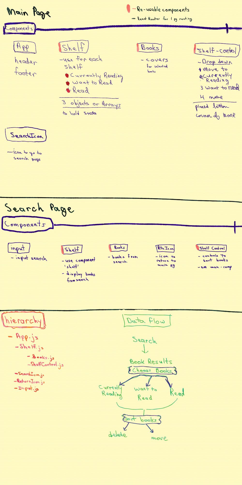

# My Reads App
##### Project for the *Front-End Web Developer Nanodegree*

#### Introduction

**Title**: My Reads

by Rebecca Hanlon

*My Reads* is a bookshelf for storing books.  The user can search for books then choose the book he or she wants to read and add them to the *Currently Reading Shelf*, *Want to Read Shelf* or the *Read Shelf*.

Click [here](#picture-of-data-and-components-breakdown) to see the component and data break down of the app.

Click [here](#pictures-of-responsive-design) to see pictures of the website's Responsive Design.

 

##### Start-up Server

To start up the server

##### Technical Components
- CSS Grid, Flexbox and Media Queries used to build the _responsive features_.
- JavaScript (ECMASript 6) and React are used for user interactions which include:
    -
- *Tutorial Request: FEND Project 6 - Walk Through (Short)* by Ryan Waite, [video](https://www.youtube.com/watch?v=N8bU1oWlLwY&feature=youtu.be
)

- CSS for animations [w3schools]("https://www.w3schools.com/css/css3_animations.asp")

#### Picture of Data and Components Breakdown

#### Pictures of Responsive Design
##### Phone

##### Tablet

##### Desk Top

### Future Features
-

